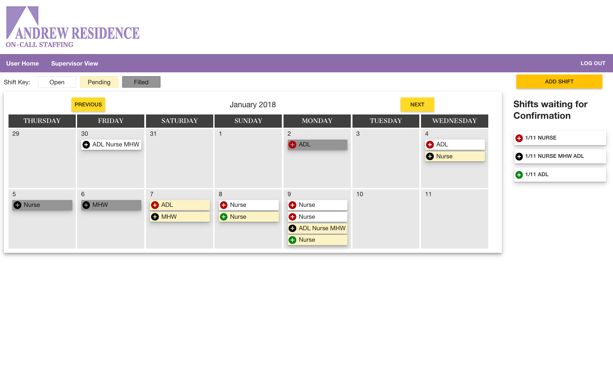
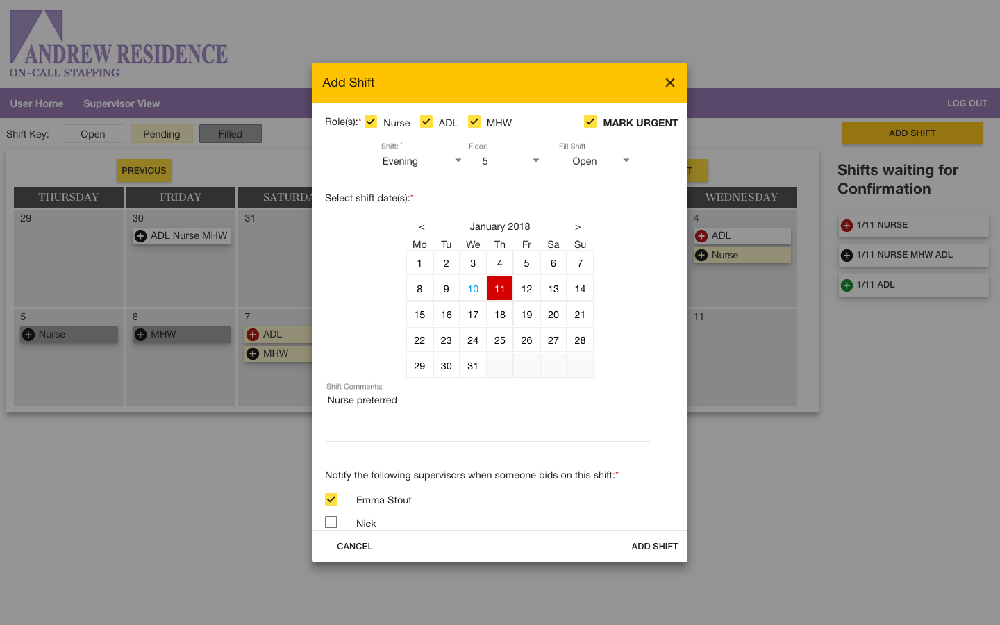
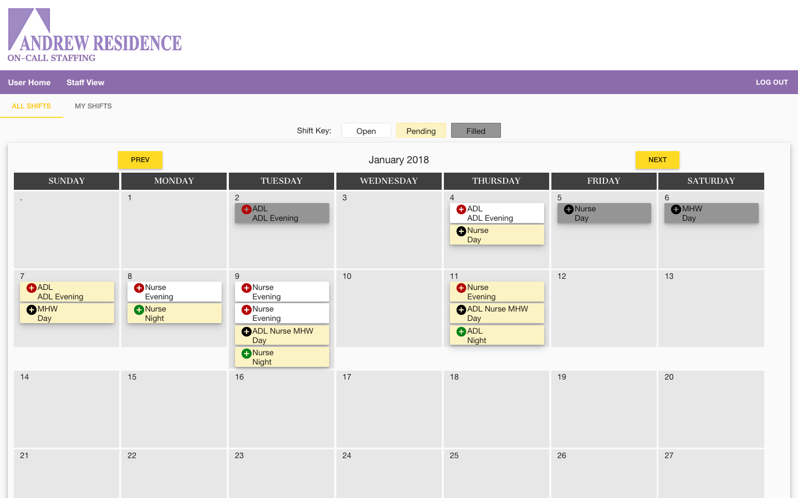

#Andrew Residence Shift Calendar

Andrew Residence requires a calendar/scheduling application to assist in sceduling on-call staff.  

## Built With

SQL
Express
AngularJS
Node.js
Nodemailer
MomentJS
Plivo API

## Getting Started

Fork repo from (https://github.com/Andrew-Residence/group-project)

Download or clone this repository
Get a [Plivo API Key and Phone Number](https://developers.plivo.com/);
Get [Google oAuth Credentials] (https://console.developers.google.com/)
Copy the example.env file and rename to .env add your Keys and Secrets


### Prerequisites

Link to software that is required to install the app (e.g. node).

- [Node.js](https://nodejs.org/en/)
- [PostgreSQL](https://www.postgresql.org/)
- [AngularJS](https://angularjs.org/)
- [Express](http://expressjs.com/)
- [Angular Material](https://material.angularjs.org/latest/)
- [Moment](https://momentjs.com/docs/)
- [Plivo Helper Library](https://www.plivo.com/docs/helpers/node/)


### Installing

Steps to get the development environment running.

```sql
CREATE TABLE `users` (
    `id` INT NOT NULL AUTO_INCREMENT,
    `name` varchar NOT NULL,
    `password` varchar NOT NULL,
    `username` varchar NOT NULL UNIQUE,
    `role` varchar,
    `phone` INT,
    `confirmed` BOOLEAN NOT NULL DEFAULT 'false',
    PRIMARY KEY (`id`)
);

CREATE TABLE `post_shifts` (
    `date` DATE NOT NULL,
    `shift_id` INT NOT NULL AUTO_INCREMENT,
    `shift` varchar NOT NULL
    `shift_status` varchar NOT NULL DEFAULT 'Open',
    `shift_comments` varchar,
    `created_by` INT NOT NULL,
    `urgent` BOOLEAN NOT NULL DEFAULT 'false',
    `adl` BOOLEAN DEFAULT 'false',
    `mhw` BOOLEAN DEFAULT 'false',
    `nurse` BOOLEAN DEFAULT 'false',
    `notify` varchar[],
    `filled` INT,
    `floor` VARCHAR(20) NOT NULL,
    PRIMARY KEY (`shift_id`)
);

CREATE TABLE `shift_bids` (
    `shift_id` INT NOT NULL,
    `user_id` INT NOT NULL,
    `bid_id` INT AUTO_INCREMENT,
    `staff_comments` (varchar),
    PRIMARY KEY (`bid_id`)
);

CREATE TABLE `confirmed` (
    `confirmed_id` serial INT NOT NULL,
    `shift_id` INT NOT NULL,
    `user_id` INT NOT NULL,
    `shift_bid_id` INT NOT NULL,
    `confirmed_by_id` INT NOT NULL,
    PRIMARY KEY (`confirmed_id`)
);

CREATE TABLE `user_availability` (
    `user_id` INT NOT NULL,
    `availability_id` INT NOT NULL AUTO_INCREMENT,
    PRIMARY KEY (`availability_id`)
);

CREATE TABLE `shift_interest` (
    `shift_interest_id` INT NOT NULL,
    `user_id` INT NOT NULL,
    `day` DATE NOT NULL,
    `shift` VARCHAR(255) NOT NULL,
    `comment` VARCHAR(255),
    PRIMARY KEY (`shift_interest_id`)
);

CREATE TABLE `pay_period` (
    `id` INT NOT NULL AUTO_INCREMENT,
    `start` DATE NOT NULL,
    `end` DATE NOT NULL,
    PRIMARY KEY (`id`)
);

ALTER TABLE `post_shifts` ADD CONSTRAINT `post_shifts_fk0` FOREIGN KEY (`created_by`) REFERENCES `users`(`id`);

ALTER TABLE `post_shifts` ADD CONSTRAINT `post_shifts_fk1` FOREIGN KEY (`filled`) REFERENCES `users`(`id`);

ALTER TABLE `shift_bids` ADD CONSTRAINT `shift_bids_fk0` FOREIGN KEY (`shift_id`) REFERENCES `post_shifts`(`shift_id`);

ALTER TABLE `shift_bids` ADD CONSTRAINT `shift_bids_fk1` FOREIGN KEY (`user_id`) REFERENCES `users`(`id`);

ALTER TABLE `confirmed` ADD CONSTRAINT `confirmed_fk0` FOREIGN KEY (`shift_id`) REFERENCES `post_shifts`(`shift_id`);

ALTER TABLE `confirmed` ADD CONSTRAINT `confirmed_fk1` FOREIGN KEY (`user_id`) REFERENCES `users`(`id`);

ALTER TABLE `confirmed` ADD CONSTRAINT `confirmed_fk2` FOREIGN KEY (`shift_bid_id`) REFERENCES `shift_bids`(`bid_id`);

ALTER TABLE `confirmed` ADD CONSTRAINT `confirmed_fk3` FOREIGN KEY (`confirmed_by_id`) REFERENCES `users`(`id`);

ALTER TABLE `user_availability` ADD CONSTRAINT `user_availability_fk0` FOREIGN KEY (`user_id`) REFERENCES `users`(`id`);

ALTER TABLE `shift_interest` ADD CONSTRAINT `shift_interest_fk0` FOREIGN KEY (`user_id`) REFERENCES `users`(`id`);

ALTER TABLE `public`.`users` ADD COLUMN `code` character varying DEFAULT 'false';

```

## Screen Shot






### Completed Features
Administrator features:
- [x] Confirm new users and indicate a new user's role (supervisor or on-call staff)
- [x] Edit users
- [x] Remove users

Communication features:
- [x] Weekly digest email is sent out to all on-call staff with all open upcoming shifts
- [x] When a supervisor posts an 'urgent' shift, an SMS is immediately sent out to all on-call staff with the role(s) that the supervisor marked when adding the shift.
- [x] When an on-call staff member picks up a shift, an email is sent to all supervisors to inform them
- [x] When a supervisor confirms an on-call staff member for a shift, an email is sent to that staff member letting them know they have been confirmed. If another on-call staff member has requested the same shift, an email will also be sent to that staff member letting them know someone else has been confirmed for the shift.

Supervisor features: 
- [x] View all open, pending and confirmed shifts in a calendar of the current pay-period
- [x] Post a new shift, including shift role(s), floor, shift time, shift date(s), and comments
- [x] Schedule urgent shifts and notify staff with SMS
- [x] Confirm on-call staff for shifts
- [x] Edit and delete an existing shift if the shift has not been confirmed

On-call Staff Features
- [x] View all open, pending and confirmed shifts in a calendar of the current month
- [x] Calendar view is mobile-responsive
- [x] View a 'My Shifts' tab that shows the shifts they have picked up, including both pending shifts and confirmed shifts
- [x] Pick up available shifts, with the option of adding comment 
- [x] Edit profile information


### Next Steps

- Receive schedule by texting keyword to Plivo Number

## Deployment

Add additional notes about how to deploy this on a live system

## Authors

* Sarah Harrington
* Marta Jopp
* Emma Stout
* Josh Nothum

## Acknowledgments

* Thank you to Chris Black and Kris Szafranski, our instructors at Prime Digital Academy.
* Thank you to instructors at Prime Digital Academy for providing the Passport architecture for this project.
